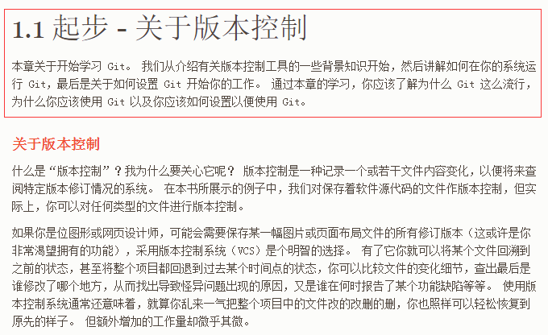

# Pro Git v2 中文版

原文地址：https://git-scm.com/book/zh/v2

目录参考：[TOC.md](TOC.md)

**起步为一级目录，内容为每章的简介**。关于版本控制、Git 简史等为二级目录。

每章简介如下图红框。

>注意：部分图片没有的从这个地址处查找，对应每章的 **images** 里面有<https://github.com/progit/progit2-zh/tree/master/book>